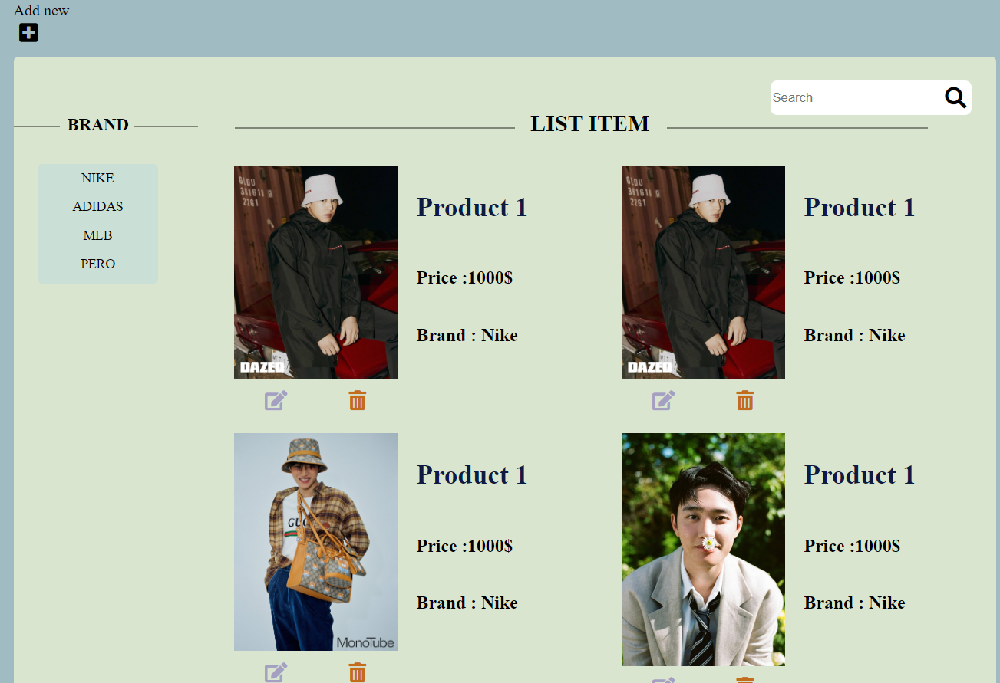

# ReactJS-training

# Overview

This document provides information about ReactJS practice. Build List of products website

# Screenshots



# Technical

- HTML5/CSS3
- ReactJS

# Timeline

25 working days

# Plan

- Plan on github [project](https://github.com/Thaoha11/react-training/projects/1)
- [Estimation](https://docs.google.com/document/d/1ADjTg72i9YvovtZ6MptBo0t1jYReN2OR/edit?usp=sharing&ouid=101599634004198816561&rtpof=true&sd=true)

# Targets

<<<<<< feature/test
- Build an application for managing product using React.
- Apply useContext and useReducer for state management.
- Using React Hooks.
=======
- Build an application for managing product using React
- Apply useContext and useReducer for state management
- Using React Hooks
>>>>>> feature/pratice-1
- Check re-render and using hook to avoid re-render.

# REFERENCES

- [ReactJS](https://reactjs.org/docs/thinking-in-react.html)
- [Styled-Component](https://styled-components.com/docs)

# Installation

- Step 1 :clone repository

```bash
git clone git@github.com:Thaoha11/react-training.git
```

- Step 2 :Checkout branch

```bash
git checkout branch feature/practice-1
```

- Step 2 :cd folder practice-1

```bash
cd practice-1
```

- step 3 :

```bash
npm i
```

- step 4 : run project

```bash
npm start
```
